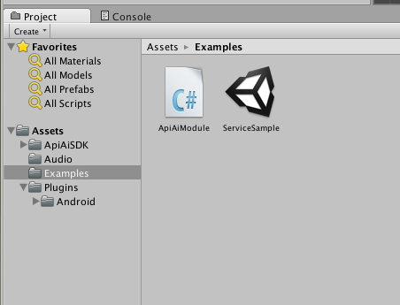
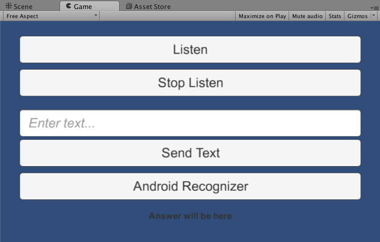
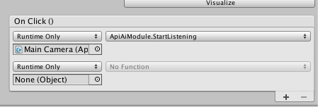
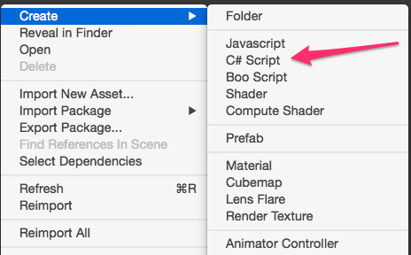

# Api.ai: Unity Plugin

The Api.ai Unity Plugin makes it easy to integrate the [Api.ai natural language processing API](http://api.ai) into your Unity project. Api.ai allows the use of voice commands and integration with dialog scenarios defined for a particular agent in Api.ai.

The Library provides a simple programming interface for making text and voice requests to the Api.ai service. 

## Getting started

To use the Unity SDK you must have Unity installed on your computer. See [official website](http://unity3d.com) for details.

### Installation

[Download](https://www.assetstore.unity3d.com/en/#!/content/31498) plugin bundle from the Unity Asset Store, and unpack it to the Assets folder in your project.

### Example

First, load and watch the **ServiceSample** scene from the Api.ai bundle. 



This sample demonstrates Api.ai SDK features.



* Top buttons start and stop listening accordingly.
* With the text field and **Send Text** button you can make text requests to the server.
* **Android Recognizer** button demonstrates recognition options available only on Android devices.

**ApiAiModule** file contains C# code for the sample scene. You can take a look at the methods in the module.

#### Initialization

In the ‘Start’ method, initialize the ‘ApiAiUnity’ object with access keys (use your access keys from [api.ai](https://api.ai) console).

```csharp
const string ACCESS_TOKEN = "3485a96fb27744db83e78b8c4bc9e7b7";
var config = new AIConfiguration(ACCESS_TOKEN, SupportedLanguage.English);
apiAiUnity = new ApiAiUnity();
apiAiUnity.Initialize(config);
```

and configure handlers for ‘OnResult’ and ‘OnError’ events

```csharp
apiAiUnity.OnError += HandleOnError;
apiAiUnity.OnResult += HandleOnResult;
```

#### Results processing

In ‘HandleOnResult’ and ‘HandleOnError’ you need to process the server response. In the example, it will be printed to the text field.

```csharp
void HandleOnResult(object sender, AIResponseEventArgs e)
{
    var aiResponse = e.Response;
    if (aiResponse != null)
    {
        var outText = JsonConvert.SerializeObject(aiResponse, jsonSettings);
        Debug.Log(outText);
        answerTextField.text = outText;
    } 
    else
    {
        Debug.LogError("Response is null");
    }
}
```

#### Start and stop listening

The methods ‘StartListening’ and ‘StopListening’ are connected to particular buttons in the scene UI.



In the ‘StartListening` method you need to pass the ‘AudioSource’ object to the ‘apiAi’ object. ‘AudioSource’ will be used for audio capturing.
``` csharp
public void StartListening()
{   
    var aud = GetComponent<AudioSource>();
    apiAiUnity.StartListening(aud);
}
```

The ‘StopListening’ method is quite simple. All the work is done in the ‘ApiAi’ module.

``` csharp
public void StopListening()
{
    try
    {
        apiAiUnity.StopListening();
    } 
    catch (Exception ex)
    {
        Debug.LogException(ex);
    }
}
```

#### Text requests

Another way to make requests is through **text requests**. In this case, results will not fire the ‘OnResult’ event. All work will be done simultaneously.

``` csharp
public void SendText()
{
    try
    {
        var text = inputTextField.text;
        var response = apiAiUnity.TextRequest(text);
        if (response != null)
        {
            var outText = JsonConvert.SerializeObject(response, jsonSettings);
            Debug.Log("Result: " + outText);
            answerTextField.text = outText;
        } 
        else
        {
            Debug.LogError("Response is null");
        }
    } 
    catch (Exception ex)
    {
        Debug.LogException(ex);
    }
}
```

#### Native Android recognition

In some cases it will be useful to use the Google recognition engine built into the Android platform. This way has at least one advantage: using voice activity detection. This means you don't need to stop listening manually.

To start native Android recognition, all you need is a call appropriate method:

``` csharp
public void StartNativeRecognition()
{
    try
    {
        apiAiUnity.StartNativeRecognition();
    } catch (Exception ex)
    {
        Debug.LogException(ex);
    }
}
```

But the Unity platform needs one more step to make the Unity<=>Android interop work. You need to call the Update method once per frame. To do this, enter the code below:

``` csharp
// Update is called once per frame
void Update()
{
    if (apiAiUnity != null)
    {
        apiAiUnity.Update();
    }
}
```

### Create helper module

* Add a new script to the Assets folder (ApiAiModule, for example) 

* Your new module should look like this:

  ``` csharp
    using UnityEngine;
    using System.Collections;

    public class ApiAiModule : MonoBehaviour {

        // Use this for initialization
        void Start () {

        }

        // Update is called once per frame
        void Update () {

        }
    }
  ```

* First add Api.ai using

  ``` csharp
    using fastJSON;
    using ApiAiSDK;
    using ApiAiSDK.Model;
    using ApiAiSDK.Unity;
  ```

* Add a private field to your module to keep the reference to the SDK object:

  ``` csharp
    private ApiAiUnity apiAiUnity;
  ```

* At the start of your module, the ApiAiUnity object must be initialized. Required data for initialization are the keys from your development console on [api.ai](http://api.ai) service and a supported language:

  ``` csharp
    // Use this for initialization
    void Start()
    {
        const string ACCESS_TOKEN = "your_access_token";

        var config = new AIConfiguration(ACCESS_TOKEN, SupportedLanguage.English);

        apiAiUnity = new ApiAiUnity();
        apiAiUnity.Initialize(config);

        apiAiUnity.OnResult += HandleOnResult;
        apiAiUnity.OnError += HandleOnError;
    }
  ```

* ‘OnError’ and ‘OnResult’ events are used for processing service results. Handling functions must look like this:

  ``` csharp
    void HandleOnResult(object sender, AIResponseEventArgs e)
    {
        var aiResponse = e.Response;
        if (aiResponse != null) {
            // get data from aiResponse
        } else {
            Debug.LogError("Response is null");
        }
    }

    void HandleOnError(object sender, AIErrorEventArgs e)
    {
        Debug.LogException(e.Exception);
    }
  ```

### Usage

ApiAi Unity SDK lets you perform the following actions:

1. Start the listening process and then send voice data to the Api.ai service for recognition and processing
2. Send a simple text request to the Api.ai service
3. Use the integrated Android recognition engine to send recognized text to the Api.ai service for processing

#### Using Api.ai recognition

To use the Api.ai voice recognition service you need to provide the ApiAiUnity object with a valid ‘AudioSource’ object. This can usually be received by using the `GetComponent<AudioSource>()` function.

A temporary limitation of this situation is that if you are using Api.ai recognition, you need to stop listening manually. You can use these code snippets to start and stop listening:

``` csharp
public void StartListening()
{
    try {
        var aud = GetComponent<AudioSource>();
        apiAiUnity.StartListening(aud);
    } catch (Exception ex) {
        Debug.LogException(ex);
    }
}

public void StopListening()
{
    try {
        apiAiUnity.StopListening();
    } catch (Exception ex) {
        Debug.LogException(ex);
    }
}
```

After you start or stop listening, you will receive the Api.ai result in the ‘OnResult’ handler.

**Note**: In some cases the Unity application must get Sound Recording privileges in order to use the Microphone. To do so, change your helper module Start function like this: 

``` csharp
IEnumerator Start()
{
    // check access to the Microphone
    yield return Application.RequestUserAuthorization (UserAuthorization.Microphone);
    if (!Application.HasUserAuthorization(UserAuthorization.Microphone)) {
        throw new NotSupportedException ("Microphone using not authorized");
    }

    ... // apiAiUnity initialization...
}
```

#### Simple text requests

The use of text requests is very simple. All you need is a text query.

``` csharp
public void SendText()
{
    var text = "hello";
    try {
        var response = apiAiUnity.TextRequest(text);
        if (response != null) {
            // process response
        } else {
            Debug.LogError("Response is null");
        }
    } catch (Exception ex) {
        Debug.LogException(ex);
    }
}
```

**Note**: You will receive the Api.ai result immediately, not in the ‘OnResult’ handler.

#### Using native Android recognition

This situation is only applicable for Android Unity applications. You can check if an application is running on the Android platform using this simple code snippet:

``` csharp
if (Application.platform == RuntimePlatform.Android) {
    // you can use Android recognition here
}
```

Because native Android recognition uses a Unity-to-Native bridge, you need to add the following code to the script ‘Update’ method. This code is used to check recognition results from the native layer, since callbacks are not supported in this case.

``` csharp
if (apiAiUnity != null) {
    apiAiUnity.Update();
}
```

To start the recognition process, use the simple call of the ‘StartNativeRecognition’ method.

``` csharp
public void StartNativeRecognition(){
    try {
        apiAiUnity.StartNativeRecognition();
    } catch (Exception ex) {
        Debug.LogException (ex);
    }
}
```

## How to make contributions?
Please read and follow the steps in the [CONTRIBUTING.md](CONTRIBUTING.md).

## License
See [LICENSE](LICENSE).

## Terms
Your use of this sample is subject to, and by using or downloading the sample files you agree to comply with, the [Google APIs Terms of Service](https://developers.google.com/terms/).

This is not an official Google product.